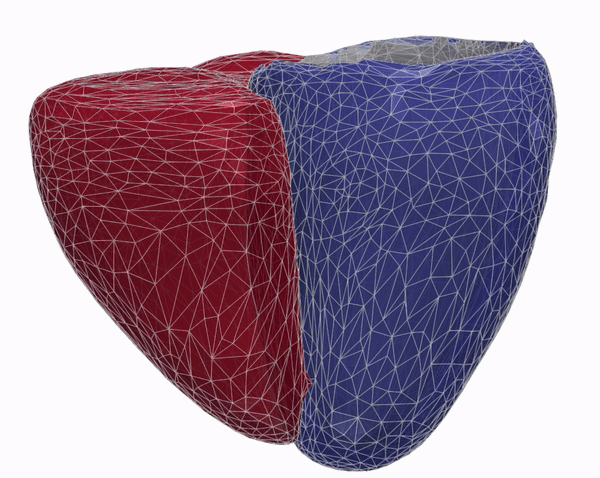
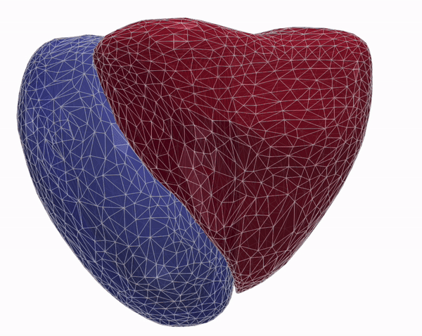
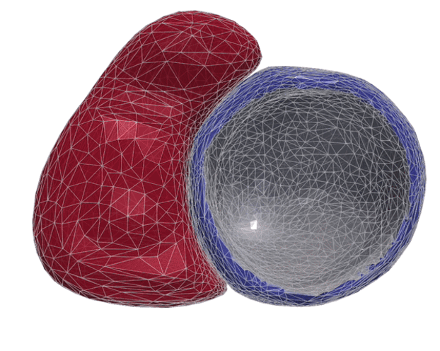

# MeshHeart: A Personalized 3D+t Mesh Generative Model for Unveiling Normal Heart Dynamics  
**Official implementation of the [Nature Machine Intelligence 2025](https://www.nature.com/articles/s42256-025-01035-5) paper**  
> Qiao M., McGurk K.A., Wang S., Matthews P., O'Regan D., Bai W.

## Overview

**MeshHeart** is a geometric deep generative model that reconstructs and generates personalized 3D+t cardiac mesh sequences from demographic and anthropometric conditions (age, sex, weight, height). It models cardiac motion dynamics using a graph-based latent VAE and temporal transformer, enabling normative modelling and disease deviation quantification across large-scale population data.


<p align="center">
  
</p>

<p align="center">
  
  
  
</p>

<p align="center">
  <em>MeshHeart generates temporally smooth, anatomically realistic 4D cardiac meshes conditioned on age, sex, weight, and height.</em>
</p>

## Features

- 🫀 Models personalized 4D cardiac mesh dynamics from clinical attributes  
- 🧠 Latent transformer VAE architecture for spatial-temporal modelling  
- ⚙️ Latent delta to quantify deviation from normal heart function  
- 🧬 PheWAS-enabled discovery of genotype–phenotype–disease links  
- 📊 Trained on 38,309 UK Biobank subjects


## Installation

```bash
git clone https://github.com/your-username/MeshHeart.git
cd MeshHeart
conda env create -f environment.yml
conda activate meshheart
